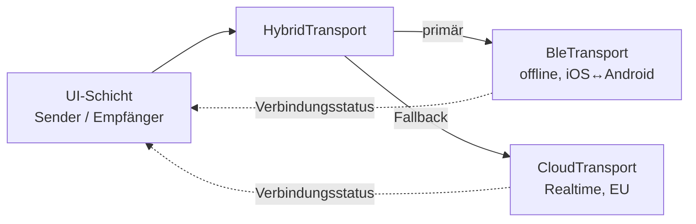

# FahrSignal – Architekturplan für die finale App

> Dieses Dokument plant das **neue, eigenständige Projekt**. Die bestehende Web-Demo
> (dieser Ordner) bleibt unverändert als Spielerei/Referenz erhalten.

## 1. Ziel & Kontext

Eine Fahrlehrperson sendet kurze, eindeutige **Fahranweisungen** an das Gerät einer
gehörlosen Fahrschülerin / eines Fahrschülers im selben Auto. Anzeige groß, farbcodiert nach
**Dringlichkeit**, Empfängergerät **ohne bedienbare Elemente** (nur Anzeige). Kein
zertifiziertes Sicherheitssystem, aber sicherheits**nah** → Verbindung muss robust sein,
auch im Funkloch.

Produktidee: Sarah. Zielgeräte: **iPhone/iPad + Android**. Erste Zielgruppe: iPhone.

## 2. Getroffene Entscheidungen

| Thema | Entscheidung | Begründung |
|---|---|---|
| Plattform | **Flutter** (Dart) | Eine Codebasis für iOS + Android |
| Verbindung | **Hybrid**: lokal (BLE) primär, Cloud als Fallback | Muss auch ohne Mobilfunk im Auto funktionieren |
| Geräte | **Apple + Android** | Größere Zielgruppe, ökosystemübergreifend |
| Lokaler Transport | **Bluetooth Low Energy (BLE/GATT)** | Einzige zuverlässige **offline & iOS↔Android**-Option; Kommandos sind winzig |
| Cloud-Transport | Managed Realtime (EU-Region) | Fallback + Fern-Setup |

## 3. Verbindungsarchitektur (Kernstück)

### 3.1 Warum BLE und nicht Nearby/Multipeer/WebRTC?
- **Apple MultipeerConnectivity** und **Google Nearby Connections** sind je Ökosystem top,
  können aber **nicht miteinander** reden (iOS↔Android geht nicht). Scheidet für „Apple + Android" aus.
- **WebRTC** braucht Signaling + meist STUN/TURN → nicht wirklich offline.
- **BLE/GATT** funktioniert **cross-platform und ohne Internet**, Latenz im Bereich weniger
  hundert ms, Reichweite fürs Fahrzeuginnere mehr als ausreichend. Eine Fahranweisung ist nur
  ein Enum + Zeitstempel (wenige Bytes) → BLE ist dafür ideal, keine Bandbreitenprobleme.

### 3.2 Lokaler Transport – BLE-Rollen
- **Empfänger (Fahrschüler) = GATT-Peripheral**: bewirbt eine feste Service-UUID.
- **Sender (Fahrlehrer) = GATT-Central**: scannt nach der Service-UUID, verbindet, schreibt
  Kommandos in eine „command"-Characteristic; Empfänger erhält sie per Write-Callback.
- **Rückkanal** (Präsenz/optionale stille Empfangsbestätigung): zweite Characteristic mit
  Notify vom Empfänger zum Sender. Verbindungsabbruch = sofort erkennbar (BLE-Disconnect-Event).
- Kandidat-Paket: `bluetooth_low_energy` (Central **und** Peripheral auf iOS/Android) —
  **vor Festlegung mit einem Spike verifizieren** (Peripheral-Rolle auf iOS ist der Knackpunkt).

### 3.3 Cloud-Fallback
- Greift, wenn kein lokales Pairing möglich ist (z. B. Ersteinrichtung, Test aus der Ferne).
- Managed Realtime mit **EU-Hosting** (DSGVO): z. B. Supabase Realtime (Broadcast-Channels)
  oder Firebase RTDB (europäische Region). Raum = Channel/Pfad, wie in der Demo.
- Bewusst **zweitrangig**: Für den Fahrbetrieb ist BLE der Standardweg.

### 3.4 Transport-Abstraktion (aus der Demo übernommen)
Die Demo hat bereits die richtige Idee: eine dünne Schnittstelle, hinter der der Transport
austauschbar ist. Das wird 1:1 zum Architektur-Kern der App.

```dart
abstract class SignalTransport {
  Future<void> connect(String roomCode, Role role);
  Stream<ConnectionState> get connection;   // connected / lost / searching
  Future<void> sendCommand(DriveCommand cmd);
  Stream<DriveCommand> get commands;         // Empfängerseite
  Future<void> disconnect();
}
```
Implementierungen: `BleTransport`, `CloudTransport`, **`FakeTransport`** (Dev/Test, siehe §8b).
Ein `HybridTransport` wählt BLE, fällt bei Ausfall automatisch auf Cloud zurück und meldet den
aktiven Kanal an die UI. Der Transport wird per **Dependency Injection** gesetzt → im Dev-/Test-Modus
wird `FakeTransport` eingehängt, ganz ohne Hardware.



### 3.5 Pairing & Raumcode
- Kopplung per **6-stelligem Raumcode** wie in der Demo, zusätzlich eine kurze Bestätigung
  auf beiden Geräten (richtiges Paar bestätigt), damit nicht versehentlich fremde Geräte in
  Reichweite koppeln.
- BLE: nach Connect Raumcode/PIN über eine „handshake"-Characteristic prüfen, sonst trennen.

### 3.6 Verbindungs-Watchdog (Sicherheit!)
- **Heartbeat**: Empfänger/Sender pingen sich regelmäßig; bleibt der Ping aus, zeigt **beiden
  Geräten** sofort eine deutliche Warnung („Verbindung verloren"). Das war in der README schon
  als Pflicht-Feature der Profi-Version genannt.
- Vor Fahrtbeginn: klarer „Verbunden & bereit"-Status auf beiden Geräten.

## 4. Nachrichten-/Datenmodell
Kleines, versioniertes Schema (identisch über BLE und Cloud):
```
DriveCommand {
  v: int              // Protokollversion
  key: string         // z.B. "links", "vorfahrt", "off"
  urgency: enum        // info | achtung | dringend  → Farbe/Vibration/Warnton
  ts: int              // Zeitstempel des Senders
}
```
- `off` blendet die Anzeige aus (wie in der Demo).
- Urgency steuert Farbe **und** Vibrationsmuster (aus der Demo übernommen).
- Verlaufsliste („letzte Hinweise") lokal auf dem Empfänger, nicht übertragen.

## 5. App-Architektur (Flutter)
- **State Management: Riverpod** (klar testbar, gut für Streams aus den Transports).
- Schichten: `ui/` (Sender-Grid, Empfänger-Anzeige, Start/Pairing) · `transport/` (Abstraktion
  + BLE/Cloud/Hybrid) · `domain/` (DriveCommand, Katalog der Kommandos, Urgency) · `platform/`
  (Wakelock, Vibration, Guided-Access-Hinweise).
- Kommando-Katalog & Kategorien/Farben aus der Demo als Ausgangspunkt.

## 6. Sicherheit & UX-Pflichten (aus Demo + Erweiterungen)
- Empfängerbildschirm **ohne bedienbare Elemente** (nur Anzeige).
- Große Symbole, hoher Kontrast, Farbcodierung nach Dringlichkeit, kurze Anzeigedauer.
- **Display an lassen** (Wakelock), Hinweis auf iOS-Kurzbefehl/Geführten Zugriff bzw. Android-Pinning,
  damit das Empfängergerät nicht aus der App springt.
- Automatische **Verbindungsabbruch-Warnung** (siehe 3.6).

## 7. Datenschutz (DSGVO)
- **Local-first ist ein Datenschutz-Vorteil**: im BLE-Modus verlassen keine Daten das Auto.
- Keine Klarnamen/PII nötig; Raumcode ist anonym und kurzlebig.
- Cloud-Fallback nur mit EU-Hosting, minimalen Daten, Ablaufzeiten.
- Vor gewerblichem Einsatz: Datenschutzerklärung, AVV mit Cloud-Anbieter, Haftungsfrage klären.

## 8. Build & Release **ohne MacBook** (wichtig!)
- Android lässt sich komplett auf Linux/Windows bauen & testen.
- **iOS-Builds brauchen zwingend die macOS-Toolchain** – aber kein eigener Mac nötig:
  - **Cloud-CI** wie **Codemagic** (Flutter-nah, kostenloses Kontingent), **GitHub Actions**
    (macOS-Runner) oder Bitrise baut/signiert die iOS-App.
  - Für interaktives iOS-Debugging ggf. stundenweise **Mac in der Cloud** (MacStadium/MacinCloud).
  - Apple Developer Program (99 $/Jahr) für TestFlight/App Store nötig.
- Empfehlung: Von Anfang an Codemagic/GitHub-Actions-Pipeline einrichten → iOS-TestFlight-Builds
  ohne lokalen Mac.

## 8b. Lokale Entwicklung & Testbarkeit (Pflicht während der Entwicklung)
Alles muss **ohne zwei Handys und ohne Mac** lokal testbar sein. Der Schlüssel ist wieder die
Transport-Abstraktion – BLE lässt sich in Emulatoren praktisch nicht testen, also darf die
Entwicklung nicht davon abhängen.

- **`FakeTransport` (Loopback):** verbindet Sender und Empfänger im selben Prozess bzw. über
  einen winzigen lokalen WebSocket. Damit laufen **UI, Logik, Urgency-Farben, Watchdog,
  Verlauf** komplett am Entwicklungsrechner – analog zum `BroadcastChannel` der Web-Demo.
- **Flutter Desktop/Web als schnelle Dev-Ziele:** die App auf **Linux/Chrome** starten und
  **zwei Fenster** (Sender + Empfänger) mit `FakeTransport` koppeln – sekundenschnelle Iteration
  ohne Gerät. (Läuft auf deinem Rechner ohne Mac.)
- **Dev-„Split-Screen":** optionaler Debug-Screen, der Sender- und Empfängeransicht
  nebeneinander in einem Fenster zeigt – ideal fürs UI-Feintuning.
- **Cloud-Transport lokal:** **Firebase Emulator Suite** bzw. **Supabase local (Docker)** →
  `CloudTransport` vollständig offline am Rechner testen, keine echten Server nötig.
- **Automatisierte Tests:** Unit-/Widget-Tests laufen gegen `FakeTransport` (deterministisch,
  kein Netz/keine Hardware) in `flutter test` – auch in der CI.
- **BLE zuletzt & gezielt:** `BleTransport` wird auf **zwei echten Geräten** getestet (Emulator
  kann kein BLE). Bis dahin deckt `FakeTransport` die gesamte übrige Entwicklung ab.
- **Android-Gerätetest ohne Mac:** direkt vom Linux-Rechner per USB/`adb`. iOS-Gerätetest
  später über die Cloud-CI (§8) bzw. stundenweisen Cloud-Mac.

## 9. Roadmap / Phasen
1. **Spike (1–2 Tage):** BLE-Peripheral-Rolle auf iOS **und** Android mit `bluetooth_low_energy`
   verifizieren (Go/No-Go für den lokalen Transport).
2. **MVP:** Flutter-Grundgerüst, Transport-Abstraktion, **`FakeTransport` zuerst** (komplette
   UI/Logik am Rechner testbar), dann `BleTransport`, Sender-Grid + Empfänger-Anzeige, Wakelock,
   Verbindungs-Watchdog.
3. **Hybrid:** `CloudTransport` + `HybridTransport` mit automatischem Fallback.
4. **Pilot:** Test auf abgesperrtem Gelände, mit gehörlosen Fahrschüler:innen & Fachverbänden.
5. **Profi:** anpassbare Kommandos, Statistiken (opt-in), Mehrsprachigkeit, Store-Release.

## 10. Offene Punkte & Risiken
- **BLE-Peripheral auf iOS** ist das größte technische Risiko → deshalb Phase 1 als Spike.
- BLE-Latenz/Reichweite im realen Fahrzeug messen.
- Cloud-Anbieter final wählen (Supabase vs. Firebase vs. Ably) – nach DSGVO & Kosten.
- Rechtliches (Haftung, StVO/Ausbildungsrecht) vor gewerblichem Einsatz klären.
